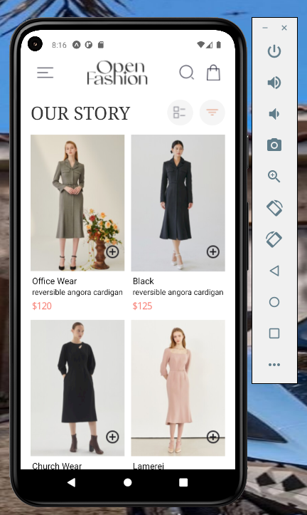
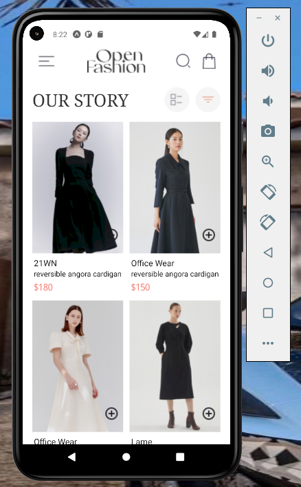
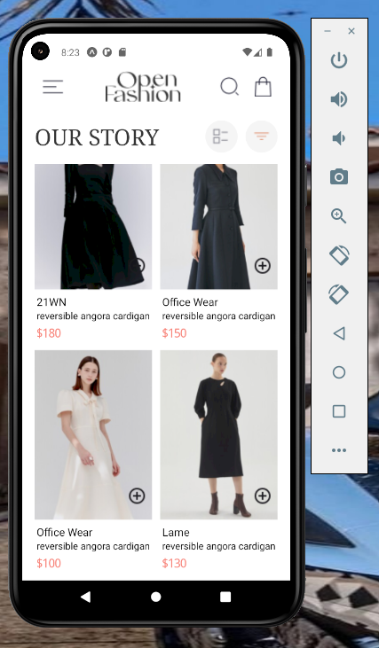
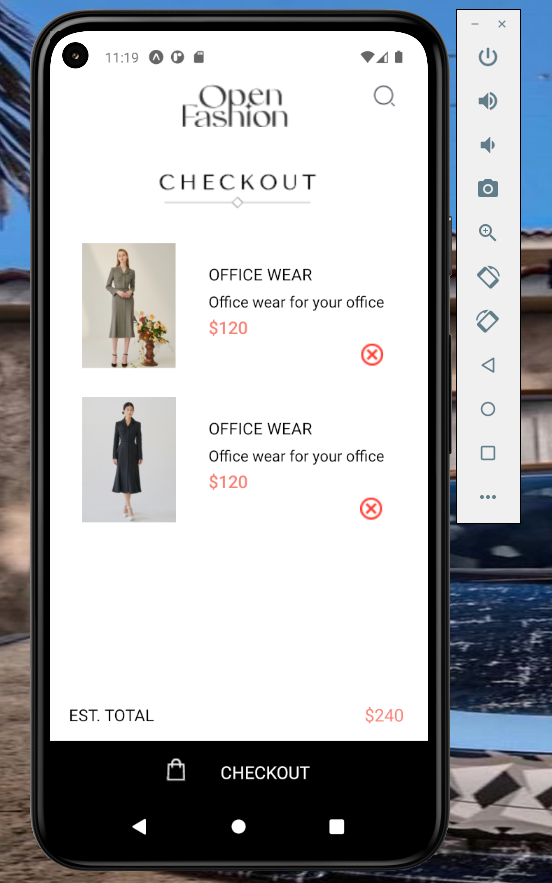
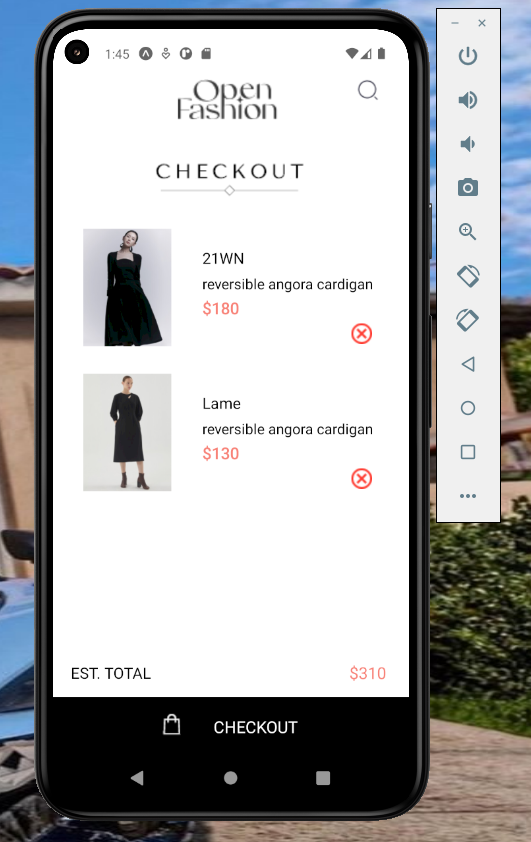
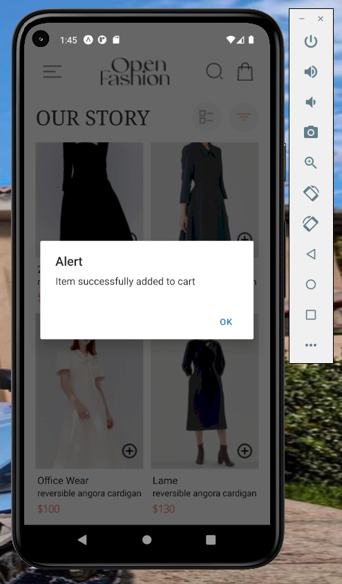
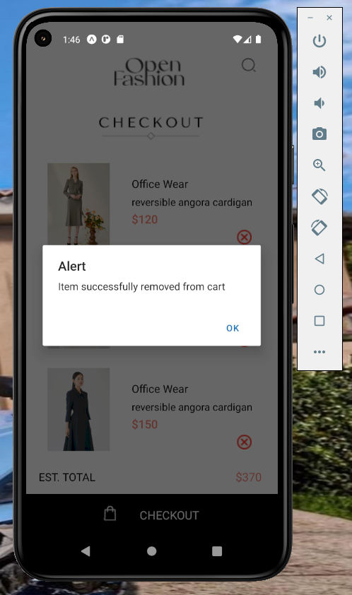
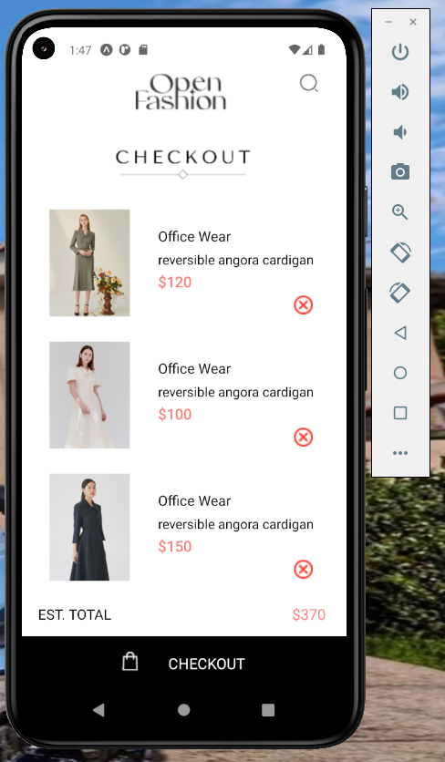

# TITLE: rn-assignment6-11293368

# Student Info
NAME: MENSAH ERSKINE  
ID: 11293368  
COURSE: DCIT 202  
ASSIGNMENT 

# Task Description

The task required creating a react native expo project. The main aspect of the task was to recreate the design as seen in a provided UI mockup.
It also included: 
 
• Including some specific components which include: HomeScreen, CartScreen, 'Add to' and 'Remove from' for each product. 

• Make use of local storage, here I am making use of the AsyncStorage. 

• The functionalities should include users being able to:  
-View a list of available products. 
-Add products to their cart. 
-Remove products from their cart. 
-View the items in their cart.

# Description of How I built my app:

For this particular assignment, I began the process by first setting up all the folders/file structures and installing all the required dependencies and packages.
 

## Design and layout choices:
For this particular project,  I didn't really make use of many custom component but rather mainly worked in the same file. So for the HomeScreen, I did all the creating and styling in the HomePage.js file then rendered itin the App.js file. And for the CartScreen i worked in two files namely the CheckOutPage.js ( for the pages styling and components and also renders the CheckOutComponent.js file ) and CheckOutComponent.js files ( I mainly created the component for the rpoducts to be rendered here with their styling ).
 

### HomeScreen:
For this screen, I divided it into sections then went further to create and style the created components.  
-  Topmost component: I made use of the Image, TouchableOpacity components and wrapped it in a view component and applied the required styles to match the UI mockUp.
-  Second section: Made use of the Text component and also the Image and view components.
-  Main section: Firstly, I wrapped it in a scrollview component. Its data componets where stored in the DataStorage.js and referenced accordingly. The pairs function found in the file was created to enable rendering product items from its array in consecutive pairs of two. Also the usage of pairs.map enables iterating through each pair of products being displayed. Product details are displayed, including image, name, description, and price, styled accordingly based on UI.
### CartScreen:
Here, I also divide the screen into sections but also made us of one custom component 'CheckOutComponent'.

## Navigation:
For navigation on the the whole project, I made use of the Materials Top Tabs Navigator for which I turned off the Tab option which makes it visible. :  
- npm install @react-navigation/native
- npm install @react-navigation/material-top-tabs react-native-tab-view
- npx expo install react-native-pager-view  

The main navigation processes involves:
- Navigation on the HomeScreen can be achieved by using the chart icon present at the top or just swipping left to move to the CartScreen.
- Also navigation on the CartScreen can be achieved by using the home logo icon present at the top or just swipping right to move to the HomeScreen.
 
I made use of "Tab.navigator" and the "NavigatorContainer" in the App.js file which is the entry point of the application rendering the screens.
I then created a bottom tab navigator and added the various screens to it. I also added the icons for various representations. I made use of "Tab.navigator" and the "NavigatorContainer".

## Implementation of data storage:
For the aspect of Local Storage, I made use of the AsyncStorage to store the Cart data. AsyncStorage is used to persist the cart data across the app. Here's a detailed breakdown of how it was implemented in both HomePage.js and CheckOutComponent.js. 
The first part for each screen mainly involved installiing the required packages then afterwards importaing it in each file. The rest of the process is gievn below as:   

### HomeScreen:
In HomePage.js, AsyncStorage is used in the addToCheckout function to store items when they are added to the cart.

### CartScreen
For CheckOutComponent.js, AsyncStorage is used in the removeFromCheckout function to remove items from the cart.
 
In both HomePage.js and CheckOutComponent.js, AsyncStorage is used to persistently store and retrieve the list of checkout items (checkoutItems). It ensures that the items added to the cart remain available even if the app is closed and reopened, providing a seamless shopping experience for users. Alerts are used to notify users when items are successfully added or removed from the cart. 

# Screenshot of app:
 

 

 

 

 

 

 

 

 

